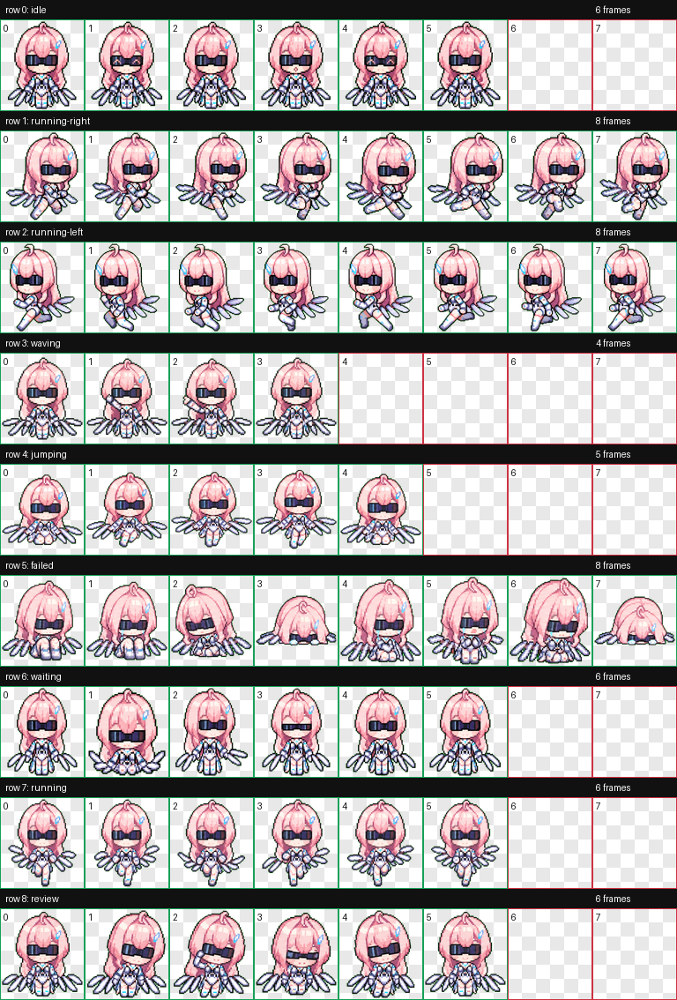

# Aemeath Codex Pet

**Aemeath** is a custom animated Codex pet: a compact cyber companion with pink hair, blue highlights, dark glasses, a futuristic outfit, and a small mechanical wing-blade silhouette.

This repository contains the ready-to-install pet package plus a QA contact sheet for quick review.

> Community-made custom pet. This is not an official OpenAI asset.

## Preview



The contact sheet shows every animation row included in the final spritesheet:

- `idle`
- `running-right`
- `running-left`
- `waving`
- `jumping`
- `failed`
- `waiting`
- `running`
- `review`

## Package

```text
aemeath/
  pet.json
  spritesheet.webp
qa/
  contact-sheet.png
README.md
```

`aemeath/pet.json` defines the pet metadata used by Codex:

```json
{
  "id": "aemeath",
  "displayName": "Aemeath",
  "spritesheetPath": "spritesheet.webp"
}
```

`aemeath/spritesheet.webp` is the final transparent animation atlas. It was validated as:

- `1536x1872` pixels
- `8` columns by `9` rows
- `192x208` pixels per cell
- transparent background

## Install

Copy the package folder into your Codex pets directory:

```text
~/.codex/pets/aemeath/
```

Final installed layout:

```text
~/.codex/pets/aemeath/
  pet.json
  spritesheet.webp
```

On Windows, the same location is usually:

```text
C:\Users\<you>\.codex\pets\aemeath\
```

After copying the files, restart the Codex app if it is already running.

## Local Source Paths

This package was assembled from a validated hatch run on the author's machine:

```text
C:\Users\15672\.codex\pets\aemeath\pet.json
C:\Users\15672\.codex\pets\aemeath\spritesheet.webp
D:\aimis\hatch-runs\aemeath\qa\contact-sheet.png
```

The full hatch run is not included here, keeping this repository focused on the installable pet package.

## QA

Before publishing, the generated pet passed the hatch-pet validation checks:

- final atlas size matched the Codex pet format
- required animation rows were present
- used cells were non-empty
- unused areas were transparent
- QA review reported no blocking errors

The included contact sheet is the quickest way to visually inspect identity consistency across rows.

## 中文说明

这是 Aemeath 的 Codex 自定义宠物包。仓库内保留了可直接安装的 `pet.json` 与 `spritesheet.webp`，以及用于预览整张动画图集的 `qa/contact-sheet.png`。

安装时，把 `aemeath` 文件夹里的两个文件放到：

```text
~/.codex/pets/aemeath/
```

Windows 通常是：

```text
C:\Users\<你的用户名>\.codex\pets\aemeath\
```
